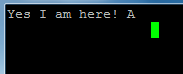

TestHub for royale
==================

The Project *TestHub* will solve your problem of having to change cameras manually while testing them.

Features
--------

- Makes testing a lot faster because everything is automated
- Automatically detects USB hub by communicating with XMC 4500 microcontroller
- Runs royale behavior-driven tests and saves results in a file corresponding to the camera name and number
- Detects if no camera is connected

Operating Systems
-----------------

This project was tested on the following operating systems:

- Windows 7
- Linux (Ubuntu 15.10)

Hardware Requirements
---------------------

To build the Testing hub you need:
- 1 XMC 4500 microcontroller by Infineon
- 6 relays
- 1 USB hub with 7 USB ports with each USB port having a On/Off switch

This project was tested on the following hardware configurations:

- PC, Intel i5-2540M, 2.6 GHz, 2 cores (32 bit)
- PC, Intel i5-5200U, 2.2 GHz, 2 cores (64 bit)

Installation & Usage
--------------------

### Windows
First you have to install the development platform [Dave™] by Infineon and the drivers for the microcontroller XMC 4500.
Both can be found on the official Infineon website for free. Next download [PuTTY] from its official website and
install that too. After installing these 3 things start [Dave™] and open the source code for the microcontroller in
the folder "Microcontroller_Code". Compile the code onto the microcontroller. If there aren't any errors start
[PuTTY]. After [PuTTY] has started change the settings so they match the ones in the following picture: **Image 1**


Before pressing open you have to change the *Serial line* so it matches the one between your computer and the
microcontroller. To do that head over to the start menu, by default on the bottom left, and select the tab devices
and printers. If the drivers for the XMC 4500 are installed correctly there should be a device which has the name
*Communications Port (COM #)*. The number is  relative to the USB port the microcontroller is connected to. In
[PuTTY] replace *COM 1* with your *COM #* and press *Open*. If you did everything correctly there should be a
console and if you type a upper case `A` then the console should show the following: **Image 2**



If you have build the USB hub correctly pressing a lower case `a` and then `1` should activate the first relay
resulting in switching on the first USB port on the USB hub. When successful continue testing all 6 ports of your USB
hub by pressing a lower case `a` and a number between 1 and 6 on your keyboard. It should look something like this if
you pressed the numbers sequentially: **Image 3**


If all relays switched on/off you can continue. If a relay didn't switch at all check the connection between the relay
and the microcontroller. If a USB port didn't switch on but the relay did check the connection between the relay and the
USB hub. Check if the wires are correctly soldered.

If you are using **Linux** you can return to the Linux section and continue.

If everything worked the way it was supposed to download [CMake] and install it. **CMAKE**


### Linux

All images mentioned in this section can be found above in the Windows section.

Since you cannot install [Dave™] on Linux you will either have to use a Windows machine&#42; or use a virtual machine
(for example [VirtualBox] which is running Windows&#42;.  You can run [PuTTY] on Linux. This means you don´t have to
 download and install it when you are on a Windows machine or on a virtual machine. You can download and install [PuTTY]
 once you are back on Linux but you don't have to. Only [Dave™] and the XMC 4500 drivers have to be installed on
 Windows&#42;.

&#42;Documentation on how to compile the microcontroller source code onto the XMC 4500 microcontroller is above in the Windows section.

After the microcontroller has the code you can check if the microcontroller works the way it should by either
downloading [PuTTY] or by using the code in the folder "Communication_Test" (Skip to next section). Either way download
[CMake] and install it. To avoid problems later open the Terminal and add yourself to the group *dialout* by using the
command `sudo usermod -a -G dialout $USER`. Do not forget to log out and log back in, or else you are not added to the
group.

To install [PuTTY] either open the console and type `sudo apt-get install putty` or use the Ubuntu software center,
search for [PuTTY] and click install. You can also install [PuTTY] manually by downloading it from the official website
and using [CMake] to install it. After its installed open it and change the settings so they match the ones in "Image
1". Only the *Serial line* will be different since its relative to the port the microcontroller is connected to. To find
out which port the microcontroller is connected to type into your console  `dmesg | grep tty`. The console will probably
show something like `ttyACM0: USB ACM device`. The only important thing for you is `ttyACM` and the corresponding `#`,
in this case its `0`. You can now replace the *Serial line* with `ttyACM0`, or if you have another `#` then `ttyAMC#`
and press *Open*. If everything was done correctly you should be having an empty console. To communicate with the
microcontroller type a upper case `A` into the console and the console should write `Yes I am here! A` back as shown in
"Image 2". If you have build the USB hub correctly pressing a lower case `a` and then `1` should activate the first
relay resulting in switching on the first USB port on the USB hub. When successful continue testing all 6 ports of your
USB hub by pressing a lower case `a` and a number between 1 and 6 on your keyboard. It should look something like
"Image 3" if you pressed the numbers sequentially. If all relays switched on/off you can continue. If a relay didn't
switch at all check the connection between the relay and the microcontroller. If a USB port didn't switch on but the
relay did check the connection between the relay and the USB hub. Check if the wires are correctly soldered.

To use the code in the folder "Communication_Test" open the Terminal and change your directory to that folder `cd
testing_hub/Communication_Test/`. Then execute the following commands:

```
mkdir build
cd build
cmake ../source/
make
./Communication_Test
```

What you did here was create a subdirectory called *build* and you used [CMake] to make Unix Makefiles.  With these
files you were able to create and execute the program *Communication_Test*. You don't have to enter a *Serial line*
because the program will automatically find the correct communication port and tell you which port is the right one. If
your USB hub is build correctly it should be switching the relays on/off sequentially. If all relays switched on/off
you can continue. If a relay didn't switch at all check the connection between the relay and the microcontroller. If a
USB port didn't switch on but the relay did check the connection between the relay and the USB hub. Check if the wires
are correctly soldered. If the Terminal is telling you `Permission denied` you didn't add yourself to the group *dialout*
or you didn't log in and out after adding yourself to the group.

**CMAKE**

[Dave™]: http://www.infineon.com/cms/de/product/microcontroller/development-tools-software-and-kits/dave-version-4-free-development-platform-for-code-generation/channel.html?channel=db3a30433580b37101359f8ee6963814
[PuTTY]: http://www.putty.org/
[VirtualBox]: https://www.virtualbox.org/
[CMake]: https://cmake.org/

License
-------

See royale_license.txt.
Parts of the software covered by this License Agreement (royale_license.txt) is using libusb under LGPL 2.1, QT5.4 under LGPL 3.0.
